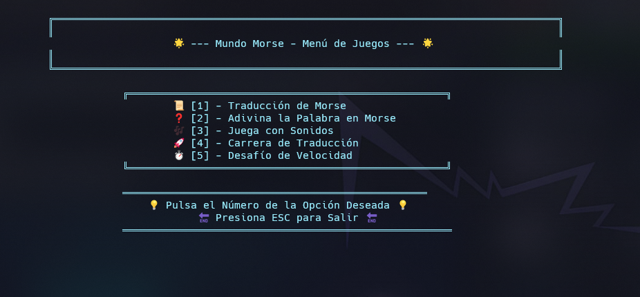

# 🌟 **Morse - Challenge** 🕹️  
¡Bienvenido a Morse - Challenge! 🎮 La forma más divertida y emocionante de aprender código Morse. ¿Listo para convertirte en un experto y dominar el arte del Morse? Traduce, adivina y compite en tiempo real mientras mejoras tus habilidades. ¡El desafío está aquí! 🚀🕹️ 


---



## 🎮 **Modos de Juego**  
- **📜 Traducir de Morse**: Convierte palabras o frases a código Morse y escucha cómo suena. 🎧  
- **🔮 Adivinar la Palabra**: Escucha el código Morse y adivina la palabra correcta. 🧠  
- **🎵 Jugar con Sonidos**: Descubre la palabra detrás del sonido Morse. 🔊  
- **🏁 Carrera de Traducción**: Traduce palabras a Morse lo más rápido que puedas. ⏱️  
- **⚡ Desafío de Velocidad**: Adivina palabras en Morse bajo presión de tiempo. 💨  
<!-- - **🌐 Modo Online con SSH** (Próximamente): Compite en tiempo real contra otros jugadores conectándote vía SSH. ¡Prepárate para un desafío global! 🌍 --> 

### 📜 Pre-Requisitos 
- Instalar .Net 
- Una terminal compatible con UTF8
- Tener Git instalado


### 🏠 Arquitectura
```
├── Main.cs
├── FuncionesJuego.cs
├── ArteAscii.cs
└── Menu.cs
```

### ¡Juega, aprende y mejora tu puntaje! 🏆

- Ejecuta el programa y sigue las instrucciones en pantalla.
- Elige uno de los modos de juego disponibles.

## 🚀 **Cómo Empezar** 

1. Clona el repositorio:
    ```bash
    git clone https://github.com/tuusuario/mundo-morse.git  
    cd mundo-morse
    ```
2. Construye y ejecuta el programa:
    ```bash
    dotnet build  
    dotnet run
    ```

> [!TIP]  
> - Para obtener la mejor experiencia, utiliza auriculares cuando juegues en modos de sonido. 🎧  
> - Comparte tus puntajes con amigos y reta a otros a superar tu marca. 🎯  
> - Mantén un registro de tus progresos y observa cómo mejoras con el tiempo. 📈  
<!-- > - ¡Mantente atento a las actualizaciones para el nuevo modo online con conexión SSH! 🌐 -->
