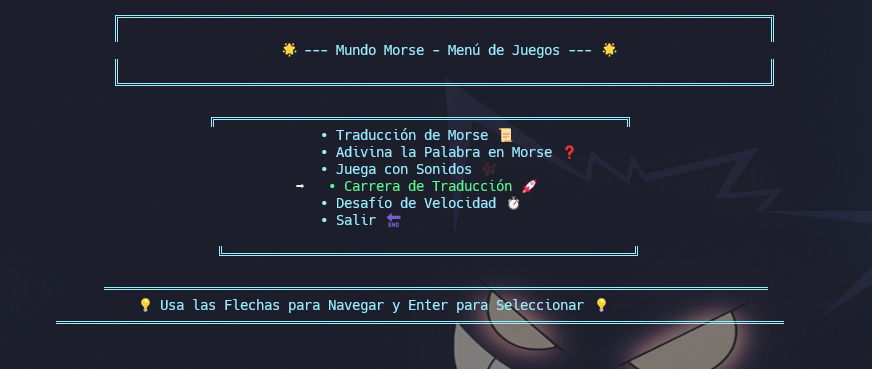

# 🌟 **Mundo Morse - Challenge** 🕹️  

¡Bienvenido a **Mundo Morse - Challenge**! 🎮 La forma más divertida y emocionante de aprender código Morse. ¿Listo para convertirte en un experto y dominar el arte del Morse? Traduce, adivina y compite en tiempo real mientras mejoras tus habilidades. **¡El desafío está aquí!** 🚀🕹️  


---





### 🚀 **Cómo Empezar**  

 -  Clona el repositorio:  
    ```bash
    git clone https://github.com/tuusuario/mundo-morse.git  
    cd mundo-morse
    ```
 - Construye y ejecuta el programa:  
    ```bash

    dotnet build  
    dotnet run
    ```

> [!TIP]  
> - Para obtener la mejor experiencia, utiliza auriculares cuando juegues en modos de sonido en volumen medio suena agudo. 🎧  
> - Comparte tus puntajes con amigos y reta a otros a superar tu marca. 🎯  
> - Mantén un registro de tus progresos y observa cómo mejoras con el tiempo. 📈  
