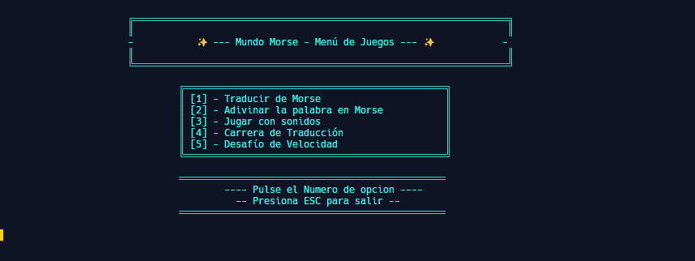

# 🌟 **Mundo Morse - Challenge** 🕹️  
¡Aprende Morse de una manera divertida y emocionante! 🎮 ¿Listo para convertirte en un experto en código Morse? Traduce, adivina y compite en tiempo real mientras mejoras tus habilidades. ¡El desafío te espera! 🚀  

## 🕹️ Cómo Jugar

- Ejecuta el programa y sigue las instrucciones en pantalla.
- Elige uno de los modos de juego disponibles.



## 🎮 **Modos de Juego**  
**📜 Traducir de Morse**: Convierte palabras o frases a código Morse y escucha cómo suena. 🎧  
**🔮 Adivinar la Palabra**: Escucha el código Morse y adivina la palabra correcta. 🧠  
**🎵 Jugar con Sonidos**: Descubre la palabra detrás del sonido Morse. 🔊  
**🏁 Carrera de Traducción**: Traduce palabras a Morse lo más rápido que puedas. ⏱️  
**⚡ Desafío de Velocidad**: Adivina palabras en Morse bajo presión de tiempo. 💨  

### ¡Juega, aprende y mejora tu puntaje! 🏆

## 🚀 **Cómo Empezar** 

1. Clona el repositorio:
    ```bash
    git clone https://github.com/tuusuario/mundo-morse.git  
    cd mundo-morse
    ```
2. Construye y ejecuta el programa:
    ```bash
    dotnet build  
    dotnet run
    ```

> [!TIP]  
> - Para obtener la mejor experiencia, utiliza auriculares cuando juegues en modos de sonido. 🎧  
> - Comparte tus puntajes con amigos y reta a otros a superar tu marca. 🎯  
> - Mantén un registro de tus progresos y observa cómo mejoras con el tiempo. 📈  

